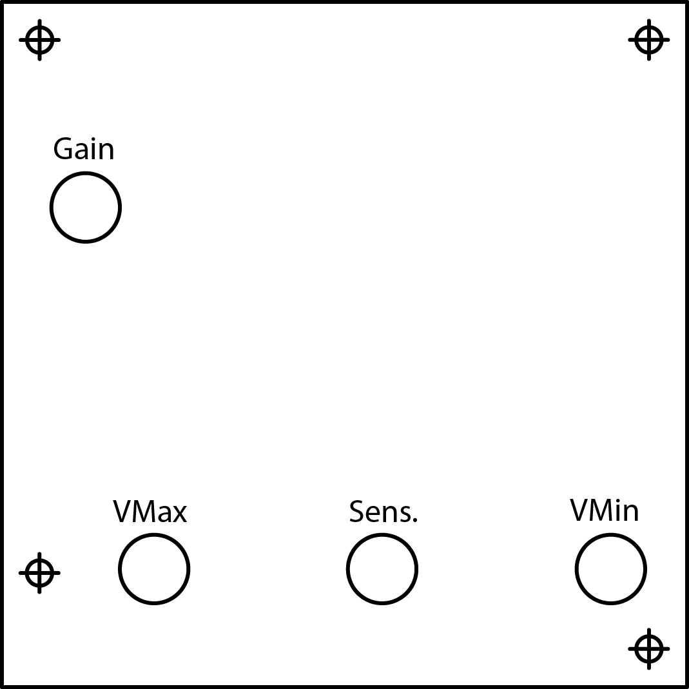
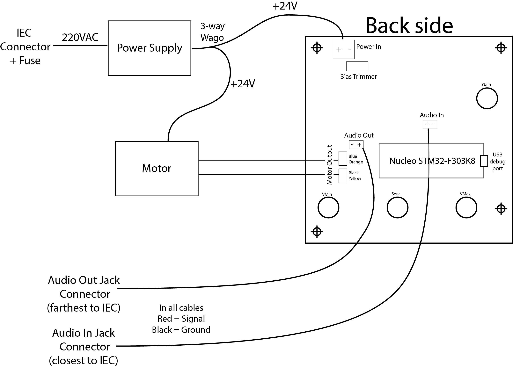

# User notes for the turntables and their electronic boards Rev.1

## Turntables

### Basic function

The board uses four potentiometers to tune its output, as described on the diagram : 

- `VMin` sets the minimum speed of the motor. This means that a weak audio signal will not affect the output, if the resulting calculation is less than `VMin`.
- `VMax` sets the maximum speed of the motor. The behavior is the same as `VMax` : the output is clamped, independently of the sound input. `VMin` takes over `VMax` so putting `VMax` at mid value and putting `VMin` at a higher value will make the motor turn at the speed of `VMin` .
- `Sens.` sets the sensitivity of the motor rotation speed.
- `Gain` sets the analog gain of the input audio signal, in order to compensate for strong or weak audio signals.

### Getting started

- Connect the audio source to the input jack.

- Connect the power cord to the IEC connector and turn on the switch on the connector.

- Check that the orange LED lights up.

- First tests :

  - Set `VMax` to the max value, `Gain` to zero, start with `VMin` at zero. Progressively increase `VMin` and check that the blue LED is progressively brighter, and that the motor speed is also increasing.
  - Now, set `VMin` to zero, check that the signal source is active and increase the gain progressively to get to the desired motor speed for the input sound source level.

- Now, you can play with `Sens.` to change the reaction of the motor to the sound level and setup appropriate `VMax` and `VMin` bounds.

  

### Wiring Diagram

> Note : when securing cables to screw terminals, please hold the screw terminal firmly, to avoid putting strain on the solder joints.

## Mechanics

### Turntable design

The Teknik Clearpath motor chosen for this project is a high performance brushless motor with integrated controller. It is designed for accurate low noise moves, and has many options. It is used in many CNC equipments and reknowned for its quietness.

The motor is attached via belts and pulleys to a central shaft that supports the turntable wooden plate.
The large central shaft rotates on an industrial thrust bearing. The thrust bearing rests on a thick (8mm) aluminium plate with four holes at the corners. Four threaded rods connect the aluminium base to the MDF floor and allow some adjusting of the bearing tilt angle.
The motor itselft is fixed to the MDF via a standard NEMA 23 bracket and some MDF cutouts forming a platform.

The motor uses an imperial size shaft (3/8in) which directed the choice of the pulley to removable core ones.The pulley is slightly oversized (10mm instead of 3/8in=9.57mm). Removable core pulleys are also large : the installed ones are 40mm wide.

One requirement for the high performance of the motor  is an automated tuning sequence that needs to be run with the motor in its final position, with all the mecanics in place. The motor will automatically adapt to the dynamics of the system (mass, resonances, etc) and change its behavior accordingly.
However, this tuning process is not able to compensate for large angle dependent torque variations. The motor assumes the mecanics have fairly predictible loads, with angle independent conditions. In other words, the motor tuning will not perfrom correctly when the mechanics are too erratic, which is the case when the belt violently pulls on the motor shaft every half a turn.
In this case, the motor can only run with stock configuration, which also mean it will not be able to compensate for the torque variations quickly enough : the speed will oscillate around its commanded value, with variations up to 20% per turn.

Though the motors can easily run at slow speeds (<100RPM), the lower the RPM the more noisily they run. At and below 10RPM, higher pitch harmonics will appear, though they are only little transmitted through the mecanics themselves.

#### Potential issues
- The aluminium baseplate is held in place by four threaded rods that are attached in the MDF back using threaded inserts. These threaded rods have to bear the horizontal load of the belt pulling the assembly towards the motor. They tend to tilt and will probably degrade over time, making the circular plateau lean toward the control panel. A simple fix is to turn the thrust bearing assembly 45°, drill new holes through the MDF and place bolts with nuts and wide washers on both sides of the MDF (ideally with some threadlocker). Though not ideal, this fix should prevent the problem from getting worse. Adding MDF supports beneath the aluminium base could also improve rigidity (removing or shortening the threaded rods).
- The motor is attached to a bracket that is itself attached to the MDF structure via bolts that slide inside the bracket slots. This setup allows the height to be set when the belt is in its final position. However, it also means that is it very difficult to set height correctly, especially since the rubbing-free window is very small : the belt is almost as large as the pulley. Furthermore, it also means that the angle is hard to get horizontal, which also affects belt rubbing. Finally, since the motor is rather heavy and the MDF can be slippery, it is possible that the motor mount will gradually slide downwards.
- Air can move inside the turntable due to the various openings on the sides. This means that dust can deposit on the greased belt and be more audible. Hence, occasional re-greasing might be needed (see below for grease type choice).
- The motor has a conservative overheat limit. This means that if the torque exceeds the allowed continuous torque, the motor will go into error mode and thus stop moving. The motor must then be reset via a power cycle (turning off and on the power supply) to get back to working state. Some tuning of the motor parameters, especially the torque limit, via the ClearPath MSP software (see below) could provide workaround to this issue.

#### Last minute improvement attempts
- Adding beeswax greatly increases the overall noise. Adding grease or oil does reduce the noise. Silicon grease (from the WD40 brand) was enough for small tests, but seemed too light for prolonged use. Lithium grease is more viscous and seems better suited, but it can trap air and cause bubble to pop, making different audible sounds. 
- Pulling the motor to put the pulley upright using steel wire, tie wraps or screws is very difficult while the pulley remains this eccentric.
- Adding a soft elastic material between the motor bracket and the MDF, to dampen the oscillations is difficult given the strong belt tension (no play between the motor bracket and the MDF support). Tests done with different types of elastic material shoed no visible effect.
- Fixing the bracket using four screws (thus drilling two more holes) is very challenging.
- Adding a flexible coupler at the end of the motor shaft to accommodate for the oscillations requires very strong couplers, as the belt tension and width are large.
- Tuning the motor for the strongest torque still results in strong oscillations. The technical support might be able to manually tune the motor to compensate for it.

## Suggestions for the tables design

#### Motor assembly

- With the select aluminium pottery wheel as a basis, the motor could be attached on the side. A small rubber wheel, attached to the motor shaft via a (flexible) coupling would make firm contact and drive the main large wheel.
- One advantage of this modification would be the more comfortable work of the motor at higher RPM, which will result in less noise and velocity error.
- The motor shaft diameter is 9.57 mm (3/8in). Flexible coupling converting to metric (10mm) include 
	- https://catalog.orientalmotor.com/item/shop-blh-brushless-dc-motor-speed-control/flexible-couplings/mcl3010f06
	- https://www.vxb.com/product-p/d30-l35-3-8inch-10mm-coupling.htm
	- https://www.amazon.com/Flexible-Shaft-Coupling-Stepper-Coupler/dp/B07G843FPB
- Wheel options include
	- Large (70mm) wheel with 6mm bore and included set-screw https://www.robotshop.com/en/70mm-aluminium-wheel-6mm-bore.html 
	- Smaller wheel with 8mm bore. Will need to be  https://www.robotshop.com/en/2-stealth-wheel-8mm-bore.html 
- A more integrated solution could be : 
  - 3/8in bore mount (eliminates the need for coupler) https://www.robotshop.com/en/mount-set-screw-hub-3-8-bore.html with the associated 50mm wheel https://www.robotshop.com/en/actobotics-2-precision-wheels-black-pair.html
- This last solution seems to be the cheapest, easiest to source and to assemble while also providing good precision (that could eliminate the need for a flexible coupling). 
- The motor mount is a NEMA 23 standard hole pattern mount. Parts made for NEMA 34 should work directly. The motor being heavy and subject to tangeantial load, the mounting parts should be adequately rigid (squares should have side reinforcements). Plans of the motor are included in the `/mechanics/` folder 

#### PCB installation

Included in the `/mechanics/` folder are the locations of the holes and their bore sizes. The potentiometer shafts being standard, they are designed to be attached to a thin (<3mm) metal plate. This means that the boards should either be placed on a metal insert or a (router) thinned wooden surface (3mm thick).

The PCB also includes two 5mm LEDs : one for power and another for output level. The LEDs are not soldered to the PCB and can thus be placed anywhere above the surface of the board.

The board can be attached either via the threaded potentiometer shafts or via the four 3mm holes on the corners.

All connecting wires use screw terminals and are accessible on the bottom of the board (with the potentiometers being on the top side of the board). We still advise to install the wires before securing the board if possible.

All screw terminals are labeled, with the `-` sign indicating a ground connection (black cable).

- The largest connector is the power connector. This cable links the motor, the PCB and the power supply via two 3-way wagos.
- The `IN` terminal is the audio input
- The `OUT` terminal is the audio output (bypass)
- The two dual terminals are the motor data connection points. The letters on the terminals indicate the colors for the supplied (blue) motor cable
  - `Y` → Yellow
  - `K` → Black
  - `O` → Orange
  - `B` → Blue

Finally the included audio jacks connectors use front facing screws and not clips. The hole patterns are included in the `/mechanics/` folder.

### Power supply installation

The chosen power supply is a `MeanWell NDR-120-24` but any 24V - 5A DC power supply would work here. It mounts on DIN rail, but can also be fixed using three screws are the back, after dissassembling the DIN plastic parts.

The IEC connector hole pattern is also included in the `/mechanics/` folder. This connector uses front facing screws and not clips.

### Motor tuning

Once all the mechanics are attached, the motor can be tuned to improve its performance and ensure its stability.
Running the motor inside the assembly before tuning it can cause it to have erratic behaviour.
The tuning program ClearPath MSP only runs on Windows. An installer is included in the `/tuning/` folder. 
Teknic, the supplier of the ClearPath servo motors, has a clear tutorial on how to use the program https://www.youtube.com/watch?v=oJSp_1aNiSE and how to tune the motor https://www.youtube.com/watch?v=GcPPqOGBIFU
The selected motors are `CPM-MCVC-2310S-RLN` motors, of the Motion Control series.

Though we attribute it to the turntable instable mechanics, the motor can get lost in its configuration. We added a sane configuration file (`Small_Load_Motor_Config.mtr`) that is more or less equivalent to factory defaults to the `/tuning/` folder. Please avoid using this configuration directly when the motor is attached to mechanics, without re-tuning it first.